### OLÁ, SEJAM BEM-VINDOS!!! BORA DESENVOLVER?! 🚀

  

## 🚀 Tecnologias & Ferramentas

  

  
  
  
  
  
  

  
  

  

  
  
  

  
  
  
  

## 📊 Linguagens mais usadas

  

## 🐍 Snake Contributions

## 🌐 **Me encontre em:**  

  
  
  

  

